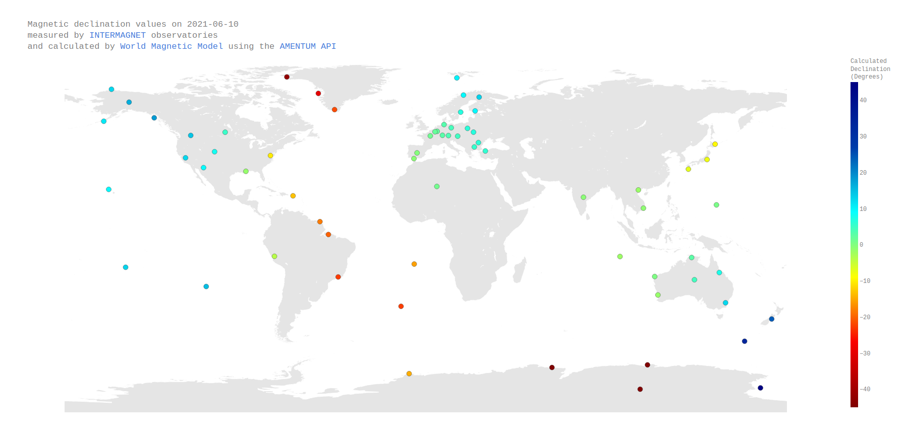

# Background 

The International Real-time Magnetic Observatory Network ([INTERMAGNET](http://www.intermagnet.org/)) monitors the Earth's magnetic field and provides important insights into the Earth's interior, atmosphere and magnetosphere. A comprehensive list of observatories and their instrumentation is provided on the INTERMAGNET website [here](http://intermagnet.org/imos/imotblobs-eng.php). The data is aggregated and made available to the public from the INTERMAGNET website.

The following study validates the World Magnetic Model model and the Amentum API by comparing results of API calls with experimental data obtained at INTERMAGNET observatories around the world on a particular date.

# Downloading data 

The aim of this study is to obtain the magnetic declination measured on a particular date by the observatory network, calculate the same using the World Magnetic Model accessed using the [Amentum API](https://amentum.space), and compare the two for the purpose of validating the model and API.

Data on a particular date can be downloaded using the form [here](http://www.intermagnet.org/data-donnee/download-eng.php). Be sure to select the following options: 

1. Sample Rate - minute
2. Data Type - best available of all types
3. Data Format - IAGA2002
4. Ensure Start and End date are the same (the analysis is only valid for a single date)

Then select 'Search for data' and wait a moment. 

Click 'Select all files' and scroll down to 'Download data' to do that. Enter your email and then hit 'Download data' again. 

Finally, click the link to 'Download ZIP file' to actually download the data.

Create a sub-directory in the directory containing this README and extract the archive therein. It will populate the sub-directory with a number of data files in IAGA2002 format (one for each observatory). Details on the IAGA2002 format can be found [here](https://www.ngdc.noaa.gov/IAGA/vdat/IAGA2002/iaga2002format.html).

# Running the script 

Assuming you are in the 'observatory' subdirectory of this repository:

Before running the script, ensure you have installed the Python module dependencies with 

    pip install -r requirements.txt 

Run the script from the command line with 

    python analysis.py --iaga_dir <path_to_iaga_files> --api_key <your_api_key>

The script will then execute and launch a browser window with an interactive graph. Roll the mouse cursor over an observatory marker to view measured and calculated values of magnetic declination for that date at the longitude and latitude indicated. 

# Results 

 

Figure 1: Screenshot of interactive plot produced by the Python script. 

# Acknowledgement 

The results presented in this document rely on data collected at magnetic observatories. We thank the national institutes that support them and INTERMAGNET for promoting high standards of magnetic observatory practice (www.intermagnet.org).

Copyright 2021 [Amentum Aerospace](https://amentum.space), Australia
