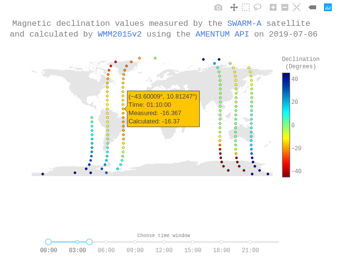

# Background 

Swarm is a European Space Agency mission to monitor the Earth's magnetic field. The mission was launched in 2013 and is comprised of 3 satellites in two different polar orbits: 2 satellites fly at an altitude of around 450 km and a third at an altitude of approximately 530 km. The satellites are equipped with a number of instruments including a vector field magnetometer (VFM) to measure the magnetic field components. The goal of SWARM is to study geodynamo processes in the Earth's interior, as well as currents in the magnetosphere and ionosphere that are affected by solar activity. More details can be found [here](https://m.esa.int/Our_Activities/Observing_the_Earth/Swarm/Introducing_Swarm)

The following analysis compares daily measurements performed by a swarm satellite and to predictions by the World Magnetic Model accessed using Amentum's API. 

# Methods 

## Data acquisition 

Full details of the data products provided by ESA to the public can be found in the [Swarm Users - Data Access Manual](https://earth.esa.int/documents/10174/1514862/Swarm-Users-Data-Access-Manual.pdf). Level 1b products are time series of quantities measured along the satellite's orbit that have been converted into engineering products. 

The low resolution magnetic vector data measured by Satellite A on a particular date can be downloaded [here](https://swarm-diss.eo.esa.int/#swarm%2FLevel1b%2FEntire_mission_data%2FMAGx_LR%2FSat_A). Once you have downloaded a ZIP file for a particular date, extract it to the working directory. The file with name similar to SW_OPER_MAGA_LR_1B_XXXXXX_0505_MDR_MAG_LR.cdf is the one containing the magnetic vector data.

The file uses the Common Data Format (CDF). CDF is a platform agnostic file format developed by NASA to store scalar and multidimensional data. Instructions for installation of the libraries, and a description of the format itself, are available [here](https://cdf.gsfc.nasa.gov/).

Lastly, an explanation of how the data is structured within the SWARM CDF file, and for all Level 1b products, can be found [here](https://earth.esa.int/web/guest/missions/esa-eo-missions/swarm/data-handbook/level-1b-product-definitions#MAGX_LR_1B_Product). 

## Software dependencies 

The Python code herein requires a third party Python module that, in turn, depends upon the CDF libraries. See [here](https://cdf.gsfc.nasa.gov/html/sw_and_docs.html) for instructions to download and install those. If you are installing via the command line under Linux, you will likely need to perform an old-school in-source build like so: 

    make OS=linux ENV=gnu64 all 
    make INSTALLDIR=<path_to_install> install

Set some environment variables with 

    . <path_to_install>/bin/definitions.B

Once you have CDF libraries installed, install the Python module dependencies with 

    pip install -r requirements.txt 

## Running the script 

Run the script from the command line with 

    python analysis.py --cdf_file <path_to_cdf_file>

The script will execute and launch the [dash app](https://plot.ly/dash/). Open a browser window and point it to the address and port shown in the terminal. 

Swarm measurements and corresponding World Magnetic Model calculations (accessed via the Amentum API) at the same longitude, latitude, time, and altitude, are overlaid onto a map. 

Roll the mouse cursor over a marker to view the measured and calculated values of magnetic declination for that time and position. 

Use the range slider to select data measured within a specific time window. 

# Results 

 

Figure 1: A screenshot of the interactive python app showing the orbital path of the SWARM-A satellite for a given time window, and a popup window showing measured and calculated values at a particular position and time. 

# Acknowledgement 

Data provided by the European Space Agency.

Copyright 2019 [Amentum Aerospace](https://amentum.space), Australia
